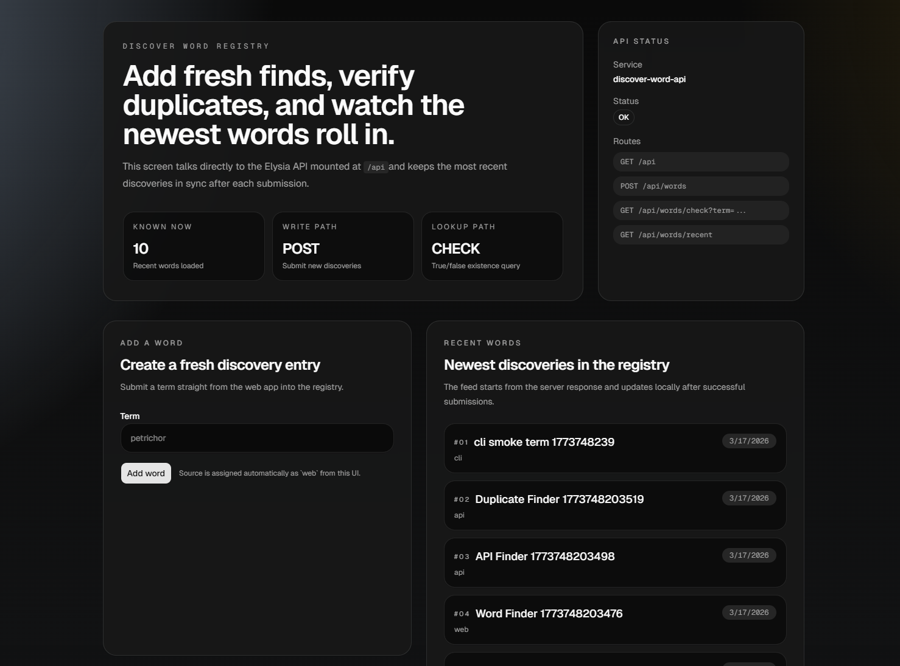

# Discover Word

Discover Word is a small word discovery registry: a polished Next.js app backed
by an Elysia API, Prisma, SQLite, and a Bun-powered CLI.



## Current State

- Add a new word from the web UI
- Check whether a term already exists before adding it again
- See the 10 most recent discoveries update after a successful submission
- Inspect live API status and available routes from the app
- Use the CLI to query status, list recents, check terms, and add entries

## Stack

- Next.js 16 + React 19 frontend
- Elysia API mounted at `/api`
- Prisma + SQLite persistence
- Commander CLI in `packages/cli`
- Bun for local development and scripts

## Run It

```bash
bun install
bun run dev
```

Open `http://localhost:3000`.

## CLI

```bash
bun run cli -- status
bun run cli -- recent --limit 5
bun run cli -- check serendipity
bun run cli -- add petrichor --source cli
```

Set `DISCOVER_WORD_API_URL` to target another environment. It defaults to
`http://localhost:3000`.

## Verify

```bash
bun run precommit
```
